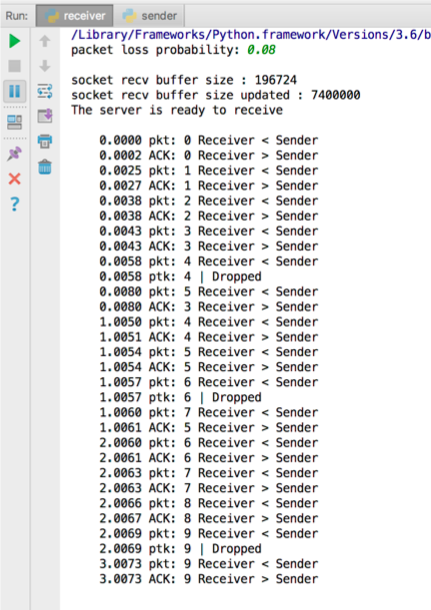
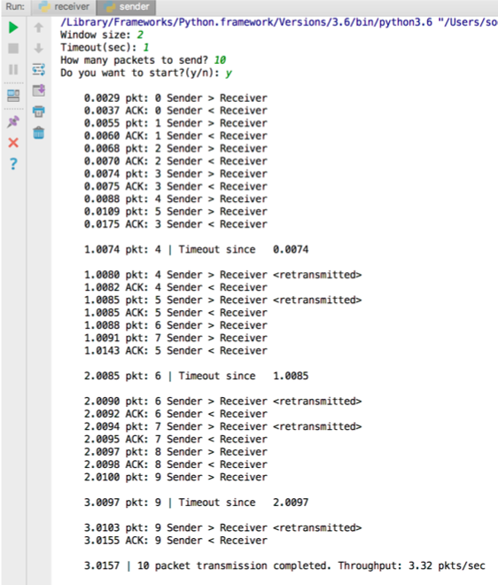

Program Environment: Windows 10

## Go-back-N with Packet Losses

A Go-back-N protocol using UDP socket programming

### Functionalities
* Receiver

	* When starting the receiver program, ask the user the *packet loss probability* (e.g., 0 ~ 1.0)
	* Bind a socket with `localhost` and the port number with 12000 (can optionally ask the user the sender's IP address and port number)
	* Display the socket receive buffer size; if it is less than 10 MB, set it to 10 MB
	* When receiving a packet, send a cumulative ACK
	* If the *packet loss probability* is less than zero, drop the received packet according to the given probability (e.g., if 0.1 > drop packets with a 10% probability)
	* Display the time information and **packet / ack** with sequcence numbers
* Sender

	* When starting the sender program, ask the user the *window size*, the *timeout value*, the *number(****total_N****) of packets to transmit*
	* The sender operates according to the Go-back-N protocol, which transmits packets as much as the window size, handles ACK packets, and maintains a single timer
	* Display the time information and **packet / ack / timeout** events
	* If all ***total_N*** packets are ACKed successfully, display the throughput (goodput) as the following: *packets / sec (****total_N**** / time spent)*
